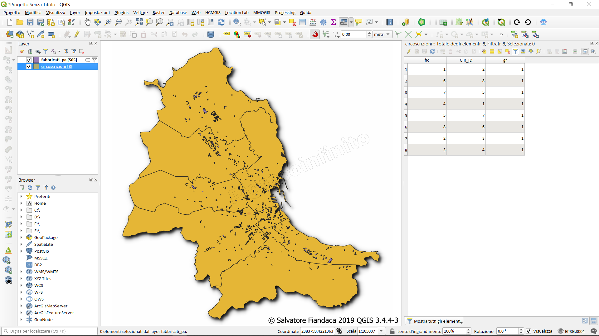
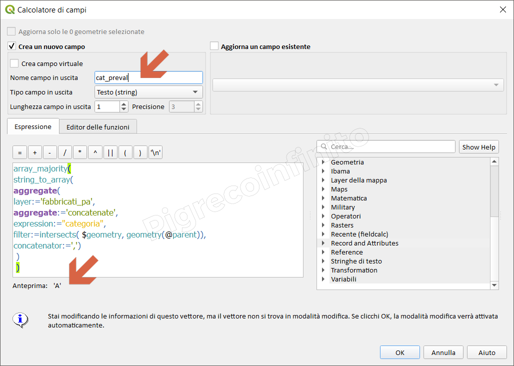
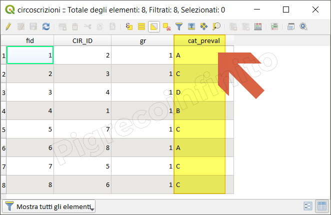

## Assegnare categoria prevalente

Dati due shapefile poligonali, _fabbricati_ e _circorscrizioni_. I fabbricati hanno un attributo (categoria) che li categorizza come A,B,C,D. Come attribuire alle circoscrizioni la categoria prevalente dei fabbricati? cioè, se ci fossero, in una circoscrizione, più fabbricati con categorie B, rispetto agli altri, allora assegnare la categoria B, oppure A se, la maggioranza dei fabbricati, fosse la categoria A.

[](../img/esempi/assegnare_cat_prevalente/cat_01.png)

Avviare il calcolatore di campi relativamente al layer _circoscrizioni_ e creiare un campo testuale:

[](../img/esempi/assegnare_cat_prevalente/cat_02.png)

popolare con la seguente espressione:

```
array_majority( 
string_to_array(
aggregate(
layer:='fabbricati_pa', 
aggregate:='concatenate', 
expression:="categoria",
filter:=intersects( $geometry, geometry(@parent)),
concatenator:=',')
) 
)
```

[](../img/esempi/assegnare_cat_prevalente/cat_03.png)

**PS:** occorre installare il plugin [ArrayPlus](https://framagit.org/jbdesbas/arrayPlus) per poter usare la funzione [array_majority](../gr_funzioni/array/array_unico.md#array_majority) nelle versioni <= QGIS 3.16; La funzione [array_majority](../gr_funzioni/array/array_unico.md#array_majority) è disponibile nativamente a partire da QGIS 3.18

Prova tu

[Geopackage](../prova_tu/dati_esempi.zip)

---

Funzioni e variabili utilizzate:

- [array_majority](../gr_funzioni/array/array_unico.md#array_majority)
- [string_to_array](../gr_funzioni/array/array_unicoo#string_to_array)
- [aggregate](../gr_funzioni/aggrega/aggrega_unico.md#aggregate)
- 