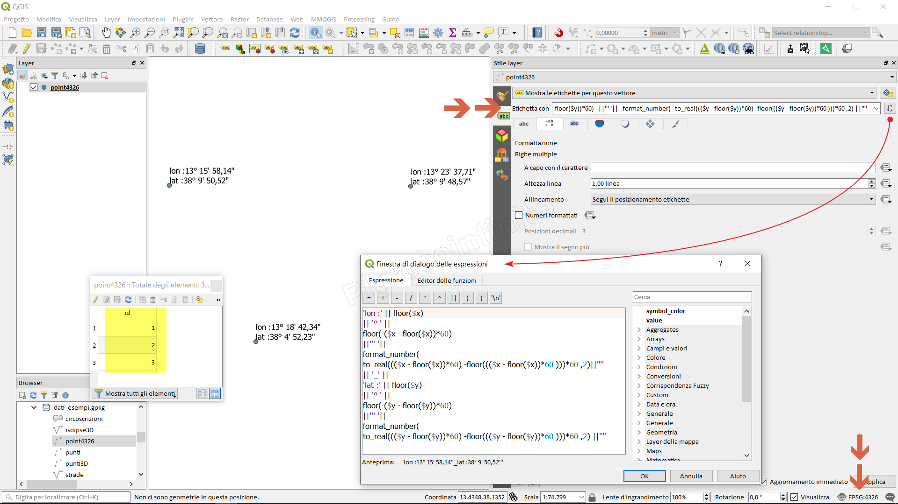

# Etichettare punti EPSG 4326 sessadecimali in sessagesimali GMS

La conversione tra i due sistemi è abbastanza semplice e quindi vado direttamente alla espressione da usare nel calcolatore di campi:

```
'lon :' || floor($x)
|| '° ' || 
floor( ($x - floor($x))*60) 
||''' '|| 
format_number( 
to_real((($x - floor($x))*60) -floor((($x - floor($x))*60 )))*60 ,2)||'" E'
|| '_' || 
'lat :' || floor($y)
|| '° ' || 
floor( ($y - floor($y))*60) 
||''' '|| 
format_number( 
to_real((($y - floor($y))*60) -floor((($y - floor($y))*60 )))*60 ,2) ||'" N'
```

[](../img/esempi/conversione/conversione1.png)

[](../img/esempi/conversione/conversione2.png)


Geopackage è [qui](../prova_tu/dati_esempi.zip)

## Nota bene

Dalla versione QGIS 3.4 è possibile usare le funzioni [to_dm](../gr_funzioni/conversioni_unico.md#to_dm) o [to_dms](../gr_funzioni/conversioni_unico.md#to_dms)

---

Funzioni e variabili utilizzate:

* [floor](../gr_funzioni/matematica/matematica_unico.md#floor)
* [format_number](../gr_funzioni/stringhe_di_testo/stringhe_di_testo_unico.md#format_number)
* [to_real](../gr_funzioni/conversioni/conversioni_unico.md#to_real)
* [\$x](../gr_funzioni/geometria/geometria_unico.md#$x)
* [\$y](../gr_funzioni/geometria/geometria_unico.md#$y)