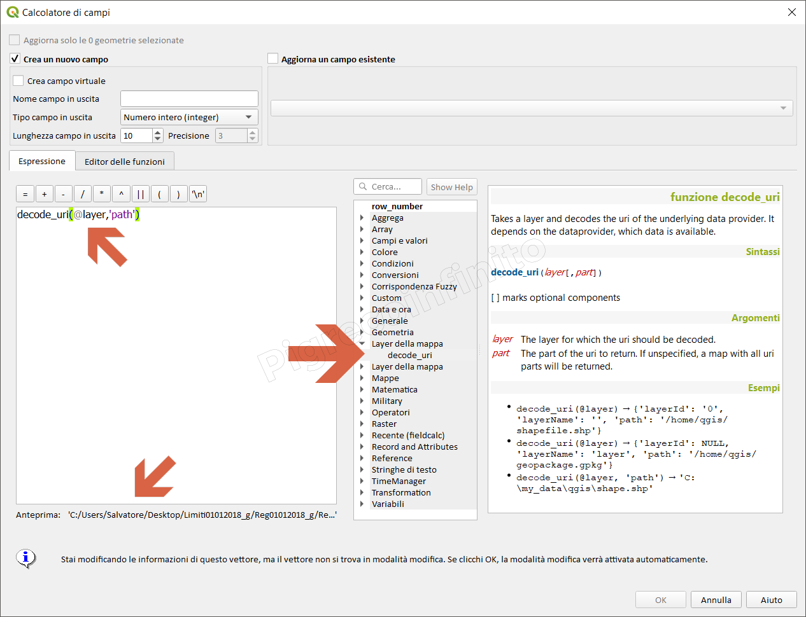
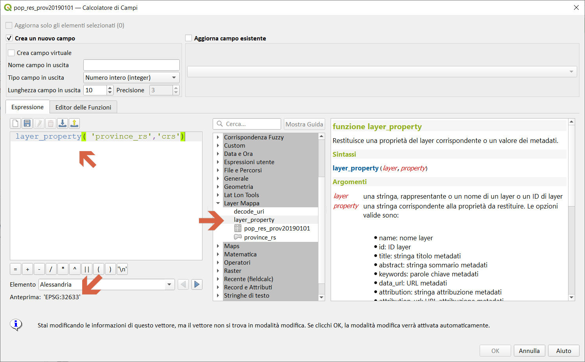

# Gruppo Layer Mappa

!!! Abstract
    **Contiene una lista dei layer della mappa che sono disponibili nel progetto corrente.**

---

## decode_uri

Prende un livello e decodifica l'uri del fornitore di dati sottostante, i dati sonodisponibili dipendono dal dataprovider.

Sintassi:

* decode_uri(_<span style="color:red;">layer</span>_,[,_<span style="color:red;">part</span>_])

[ ] contrassegna componenti opzionali

Argomento:

* _<span style="color:red;">layer</span>_ Il layer per cui l'uri dovrebbe essere decodificato
* _<span style="color:red;">part</span>_ La parte di uri da restituire. Se non specificata, verrà restituita una mappa con tutte le parti uri

Esempi:

```
decode_uri(@layer) → {'layerId': '0', 'layerName': '', 'path': '/home/qgis/shapefile.shp'}
decode_uri(@layer) → {'layerId': NULL, 'layerName': 'layer', 'path': '/home/qgis/geopackage.gpkg'}
decode_uri(@layer, 'path') → 'C:\my_data\qgis\shape.shp'
```

[](../../img/layer_della_mappa/decode_uri1.png)

---

## layer_property

Restituisce una proprietà del layer corrispondente o un valore dei metadati.

Sintassi:

* layer_property(_<span style="color:red;">layer</span>_,_<span style="color:red;">property</span>_)

Argomento:

* _<span style="color:red;">layer</span>_ una stringa, rappresentante o un nome di un layer o un ID di layer
* _<span style="color:red;">property</span>_ una stringa corrispondente alla proprietà da restituire. Le opzioni valide sono:

    - <span style="color:red;">name</span>: nome del layer
    - <span style="color:red;">id</span>: layer ID
    - <span style="color:red;">title</span>: titolo metadata
    - <span style="color:red;">abstract</span>: metadata abstract string
    - <span style="color:red;">keywords</span>: metadata keywords
    - <span style="color:red;">data_url</span>: metadata URL
    - <span style="color:red;">attribution</span>: stringa di attribuzione dei metadati
    - <span style="color:red;">attribution_url</span>: URL di attribuzione dei metadati
    - <span style="color:red;">source</span>: layer sorgente
    - <span style="color:red;">min_scale</span>: minima scala di visualizzazione per strato
    - <span style="color:red;">max_scale</span>: massima scala di visualizzazione per strato
    - <span style="color:red;">crs</span>: layer CRS
    - <span style="color:red;">crs_definition</span>: layer CRS definizione completa
    - <span style="color:red;">crs_description</span>: layer CRS descrizione
    - <span style="color:red;">extent</span>: estensione del layer (come oggetto geometrico)
    - <span style="color:red;">type</span>: tipo di layer, ad esempio Vector o Raster
    - <span style="color:red;">storage_type</span>: formato di archiviazione (solo livelli vettoriali)
    - <span style="color:red;">geometry_type</span>: tipo di geometria, ad es. Punto (solo livelli vettoriali)
    - <span style="color:red;">feature_count</span>: conteggio approssimativo delle caratteristiche per il livello (solo livelli vettoriali)

Esempi:

```
layer_property('streets','title') → 'Basemap Streets'
layer_property('airports','feature_count') → 120
layer_property('landsat','crs') → 'EPSG:4326'
```

[](../../img/layer_della_mappa/layer_property1.png)